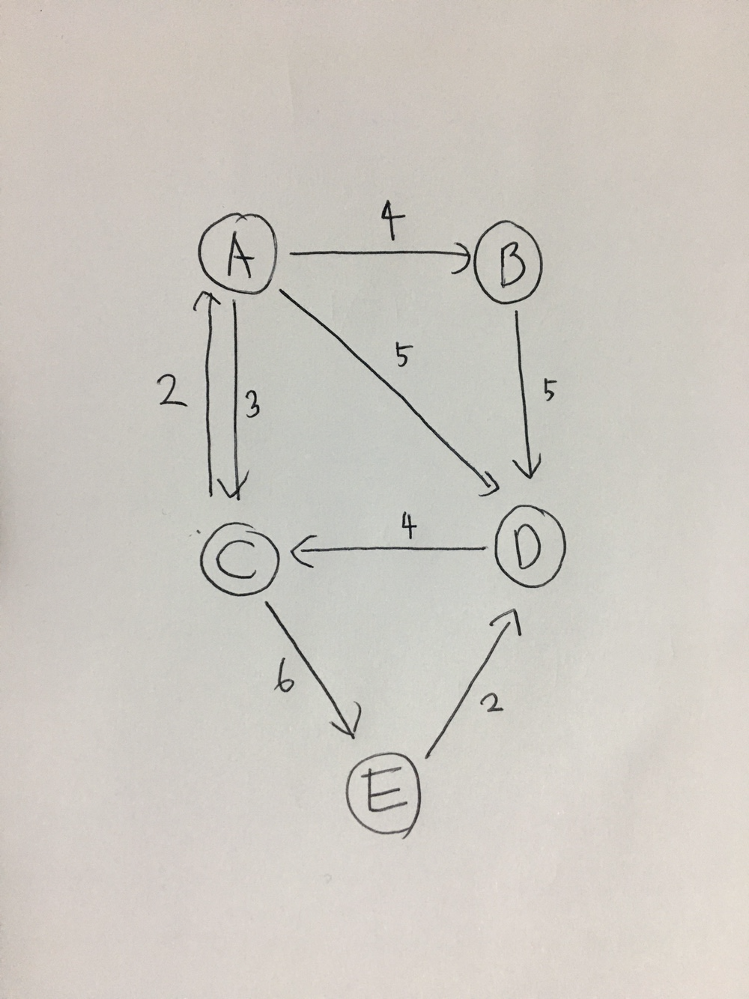

# Dijkstra Algorithm (다익스트라 알고리즘)
하나의 정점에서 다른 점들로 가는 최단 경로를 구할 때 사용하는 알고리즘. 즉, <b>최단 거리</b>를 구하고 싶을 때 사용한다.   

그림을 보면 시작점을 D로 잡고 나머지 점까지 최단 거리를 구해야 한다. 우선 D는 출발점이기 때문에 최단 거리가 0이므로 0으로 초기화한다. 그리고 나머지는 최적 경로가 아직 연결되어 있지 않기 때문에 무한대로 초기화한다.   

|A|B|C|D|E|
|---|---|---|---|---|
|INF|INF|INF|0|INF|

현재 최단 거리가 가장 짧은 노드를 고르면 D 노드이다. D 노드에서 뻗어나가는 화살표를 보면 C 노드로 이동해야 한다. 그리고 C 노드의 현재 최단 거리(INF)와 D 노드의 최단 거리(0) + D에서 C로 가는 경로(4) 값 중 더 작은 값으로 C 노드의 최단 거리로 갱신한다. 즉, INF와 (0 + 4)가 더 작은 값이기 때문에 C의 현재 최단 거리를 4로 갱신한다.   

|A|B|C|D(Checked)|E|
|---|---|---|---|---|
|INF|INF|4|0|INF|

여기서, D 노드에서 뻗어나가는 모든 노드를 방문했다는 의미로 D 노드에 Checked를 표시한다.   

Checked 표시가 된 노드(D)를 제외하고 현재 최단 거리가 가장 짧은 노드를 선택한다. 해당 노드는 C 노드이며 C 노드가 뻗어나가는 화살표들은 A(2), E(6)이다. 먼저 A 노드 방향으로 계산하면 A 노드의 현재 최단 거리(INF)와 C 노드의 최단 거리(4) + C에서 A로 가는 경로(2) 값 중 더 작은 값으로 A 노드의 최단 거리로 갱신한다. INF와 6 중 6이 더 작은 값이므로 A의 현재 최단 거리를 6으로 갱신한다.   

|A|B|C|D(Checked)|E|
|---|---|---|---|---|
|6|INF|4|0|INF|

그 다음, E 노드 방향(6)을 계산한다. E 노드의 현재 최단 거리(INF)와 C 노드의 최단 거리(4) + C에서 E로 가는 경로(6) 값 중 더 작은 값으로 E 노드의 최단 거리로 갱신한다. INF와 6 중 6이 더 작은 값이기 때문에 E의 현재 최단 거리를 10으로 갱신한다.   

|A|B|C|D(Checked)|E|
|---|---|---|---|---|
|6|INF|4|0|10|

C 노드에서 뻗어나가는 모든 노드들을 확인했기 때문에 C를 방문처리를 해야 한다.   

|A|B|C(Checked)|D(Checked)|E|
|---|---|---|---|---|
|6|INF|4|0|10|

위와 같은 방식으로 계속 반복하면 모든 노드들을 방문하게 되며 시작점인 D 노드를 기준으로 다른 노드까지의 최단 거리를 구할 수 있다.   

위와 같은 이미지처럼, 손으로 직접 그려보면서 이해하는 것이 매우 좋다.   

